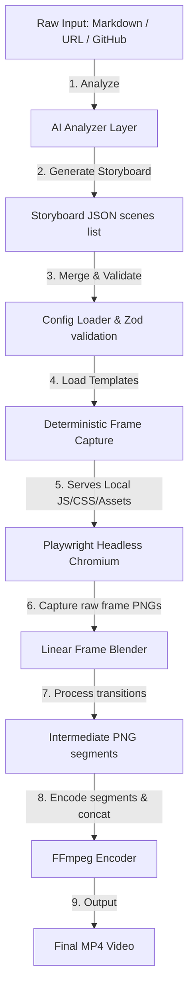

# VideoForge Architecture

This document describes the high-level architecture of **VideoForge**, a local-first, AI-assisted motion graphics video generator.

## System Flow Overview

The diagram below shows how raw input data traverses VideoForge to produce the final MP4 video.

## Core Layers

### 1. Presentation & Interfaces Layer
VideoForge can be run in four different modes, all wrapping the underlying core library API:
- **CLI**: Standard commander CLI (`videoforge init`, `videoforge render`, `videoforge analyze`, `videoforge generate`, `videoforge studio`).
- **REST API Server**: Express server running locally on `127.0.0.1:3000` to orchestrate jobs and render asynchronously.
- **MCP Server**: Model Context Protocol stdio server to connect to local AI desktop clients.
- **Studio UI**: A Vite + React web interface providing storyboard editing, parameter tuning, and live looping browser preview.

### 2. AI Content Analysis Layer
- **LLM Provider**: Decoupled interface (`LLMProvider`) mapping currently to Anthropic SDK.
- **Validate & Repair Loop**: Validates JSON storyboards generated by the LLM using Zod. If parsing or schema checks fail, errors are fed back to the LLM for correction once before throwing.
- **Analyzers**: Specific files (`markdown.ts`, `github-repo.ts`, `url.ts`) that extract facts and compile them into product configurations.

### 3. Template & Rendering Layer
- **Playwright Headless Browser**: Intercepts local requests to `http://template/index.html` to serve built-in templates dynamically without CORS or network dependencies.
- **GSAP Animations**: Built-in template cards (`title-card`, `feature-grid`, `code-snippet`, `logo-reveal`, `stat-counter`, `quote`, `outro`) configure animations that run frame-by-frame via playheads.
- **Transitions canvas blender**: Blends frames in-browser using a linear opacity Canvas blender to perform fades and cuts.
- **FFmpeg encoder wrapper**: Compresses PNG frames into individual MP4 files, then merges them using demuxers.
